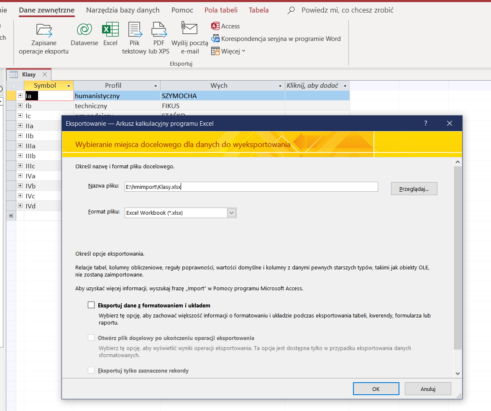
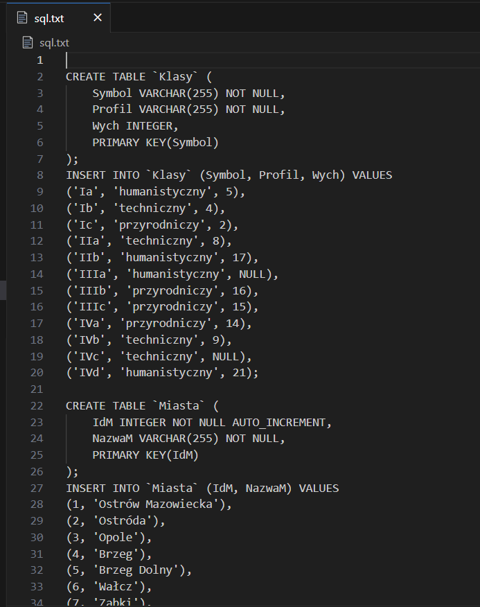
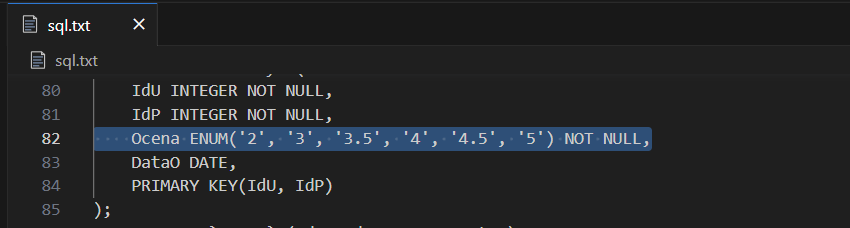
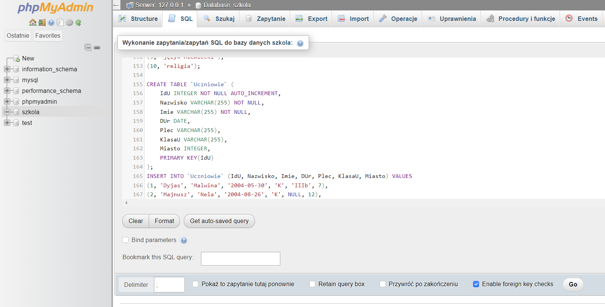
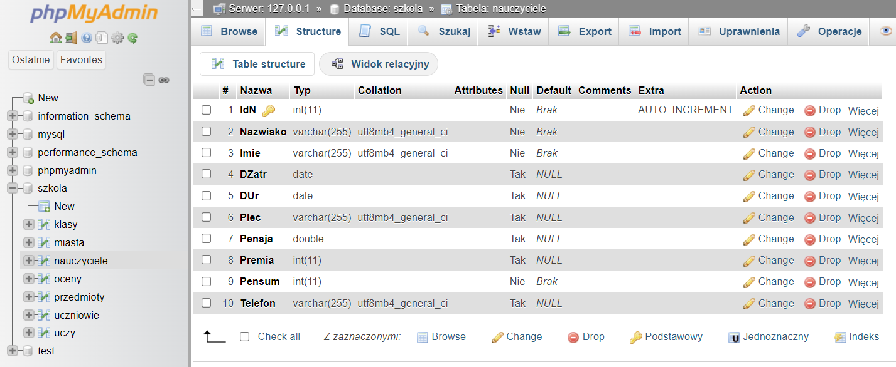

# Skrypt do importu danych z Accessa do MySQL

Skrypt umieszczony w repozytorium ma ułatwić import danych z Accessa do bazy MySQL w celu rozwiązania zadań z listy 3. Ponieważ nie istnieje prosty sposób na dogadanie się z Accessem (jest ODBC, ale strasznie dzikie), odczytywane są wyeksportowane arkusze Excelowe (`*.xlsx`) i na ich podstawie dedukowana jest struktura tabel.

## Instalacja
```
git clone https://github.com/swiszczoo/hmimport
cd hmimport
pip install -r requirements.txt
```

## Użycie
```
bulk.bat
```
lub
```
python hmimport.py nazwa_pliku_xlsx
```
np.
```
python hmimport.py Nauczyciele.xlsx
```
Po wykonaniu skryptu w schowku oraz na standardowym wyjściu pojawi się ciąg kwerend SQL, których wykonanie utworzy tabelę i wstawi do niej dane.

## Funkcjonalność

### Automatycznie
+ wykrywanie nazw tabel
+ wykrywanie typów danych (`INTEGER`, `DOUBLE`, `DATE`, `DATETIME`, `VARCHAR`)
+ wykrywanie kluczy głównych (spójny ciąg kolumn zawierających prefiks `Id` od lewej lub pierwsza kolumna od lewej)
+ wykrywanie obligatoryjności pól (jeśli wystąpi choć jedna wartość pusta)
  **Uwaga:** Nie ma rozróżnienia między ciągiem pustym a wartością *NULL*
+ ustawienie właściwości `AUTO_INCREMENT` na prostych kluczach głównych

### Co należy ręcznie poprawić
+ sprecyzować długości pól (w szczególności typu `VARCHAR`)
+ zmienić typ oceny na enumerator, tu wystarczy w definicji tabeli `Oceny` wyszukać linijkę
  ```
  Ocena DOUBLE NOT NULL,
  ```
  i zamienić ją na
  ```
  Ocena ENUM('2', '3', '3.5', '4', '4.5', '5') NOT NULL,
  ```
  przed uruchomieniem kwerendy
+ zmienić typ płci na nieinkluzywny enumerator, wystarczy zastąpić wszystkie wystąpienia  
  ```
  Plec VARCHAR(255)
  ```
  na  
  ```
  Plec ENUM('K', 'M')
  ```
+ ustawić ograniczenia usuwania i relacje
+ zmienić przynajmniej jedną wartość *NULL* na ciąg pusty w kolumnie `Telefon` w tabeli `Nauczyciele`
  
## Najprostsza procedura importu

1. Dla każdej tabeli w Accessie wybieramy  
   **Dane zewnętrzne** -> **Eksportuj** -> **Excel**  
   Jako ścieżkę docelową wybieramy folder ze skryptem (aby dalsze kroki były prostsze). Wszystkie pola wyboru mają być odznaczone.  
   

2. Uruchamiamy wsad `bulk.bat`, który uruchomi skrypt dla wszystkich arkuszy `*.xlsx` w folderze i utworzy plik tekstowy `sql.txt` zawierający ciąg kwerend importujących wszystkie dane.  
   

3. Zmieniamy typy pól `Ocena` i `Plec` na enumerator, zgodnie z instrukcją powyżej  
   

4. Tworzymy pustą bazę danych w phpMyAdminie, w karcie SQL wklejamy całą zawartość pliku `sql.txt` i klikamy `Go`  
   

5. Wszystkie prostokąty powinny być zielone. Przeglądamy bazę i sprawdzamy poprawność importu.  
   

## Disclaimer
**🔥🔥🔥 Nie odpowiadam za uwalenie przez Ciebie kursu INZ002007L w wyniku użycia tego skryptu. 🔥🔥🔥**
